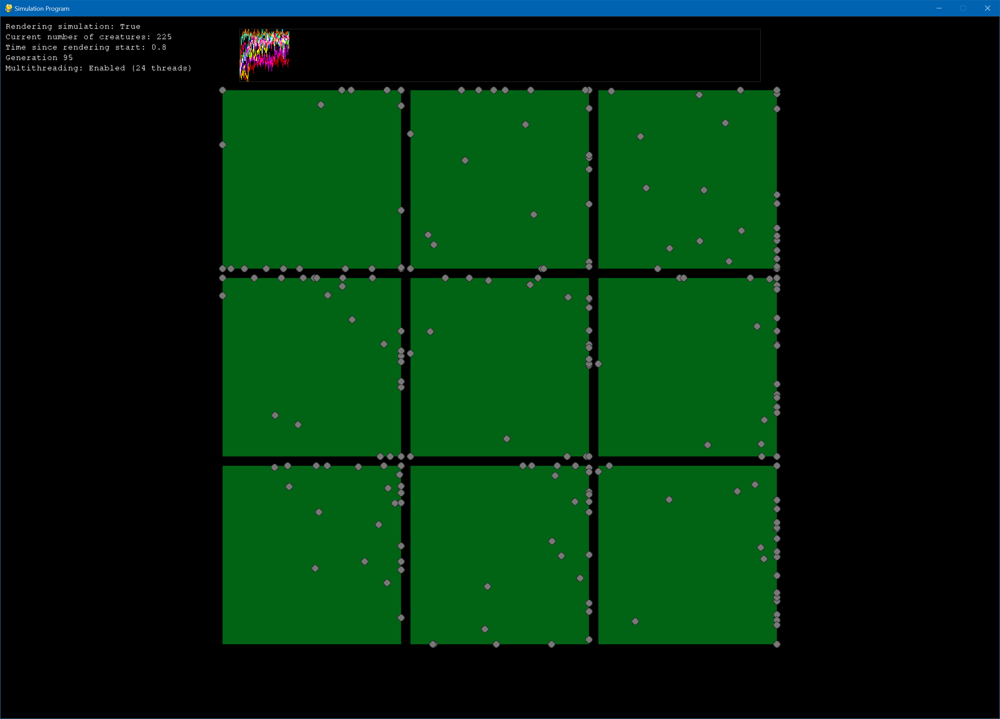
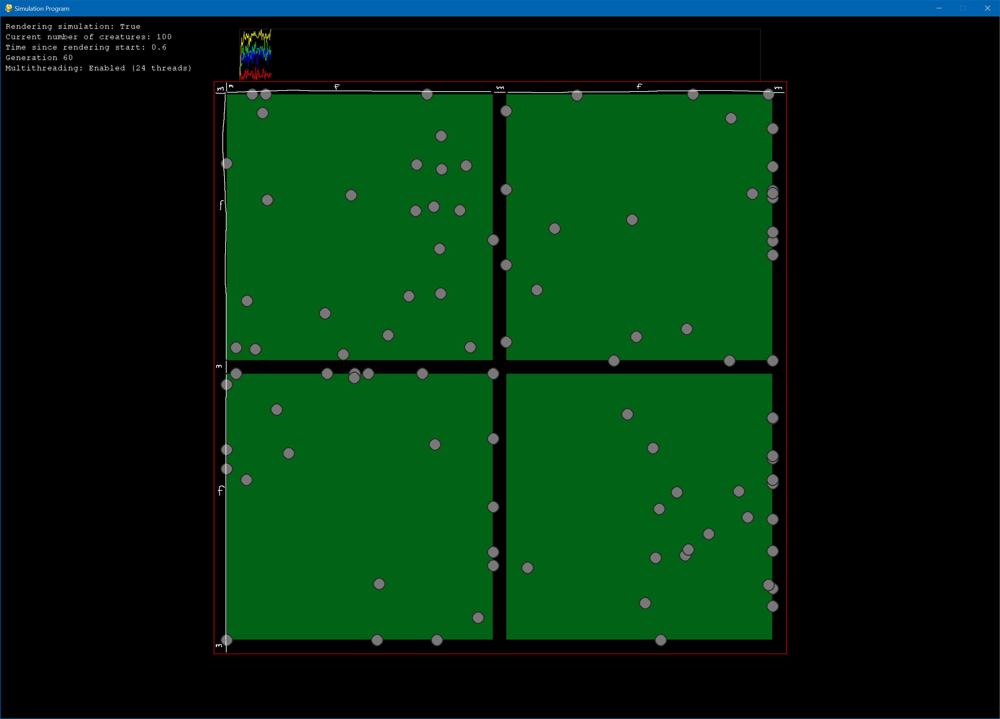

# Readme

## Description
This project is a very basic simulation for testing evolution algorithms. At this time only one algorithm is implemented. The algorithm considers a neural network brain of static size for creatures. Creatures survive based on the output of a function supplied to the simulation. The creatures that survive are used to create creatures for the next generation, modifying the weights of their neural network brains a configurable amount. Multiple simulations can be run at the same time. See the screenshot below.

## Quick Start
1. Clone the repository.
2. Create a python virtual environment and install all necessary packages using the `requirements.txt` file. This project is developed using python version 3.10.1, but may work for other versions as well.
3. Add evolution rule functions to the `src/application.py` file like the examples in that file.
    - The function must take 4 parameters as inputs.
    - The function must return a boolean.
4. Create simulations in the main function according to the `Simulation Parameters` section. Some examples are also present in the `src/application.py` file. Pass these simulations as a tuple to the `Window` constructor.
5. Run `src/application.py` in the virtual environment.

## Simulation Parameters
### Global Parameters
Several global simulation parameters are available, and need to be passed to the `Window` constructor.

**delta_time** *optional (default=0.1)* - The time that the simulation time is incremented by every timestep. Must be a positive float. 
**max_time** *optional (default=10.0)* - The simulation time after which the simulation terminates and the evolution step starts. Must be a positive float. 
**mutation_chance** *optional (default=0.01)* - Specifies the probability that any individual weight will be altered in the evolution step. Must be a float in the interval \[0, 1\]. 
**mutation_max** *optional (default=0.05)* - Specifies the maximum amount a weight can be altered by, proportional to the current value of the weight. For example if this value is equal to 0.05, the weight can be multiplied by any float in the range \[0.95, 1.05\]. Must be a float. 
**brain_hidden_layers** *optional (default=(8,))* - A tuple containing the number of nodes in each hidden layer in the neural network brains of the creatures. The number of inputs is fixed at 4 neurons, the number of outputs is fixed at 2 neurons, this means the default structure of the neural network is (4, 8, 2). 
**brain_activation_functions** *optional (default=ActivationFunction.Relu)* - Specifies which activation function(s) is/are used in the neural networks. This parameter can be one of two types:

- A single activation function, in this case this activation function will be used for all hidden layers, a linear activation function will be used for the output layer.
- A tuple containing activation functions. The tuple must contain an activation function for all layers except for the input layer. The activation functions will be used for the corresponding layers.

**enable_multithreading** *optional (default=False)* - Boolean specifying whether or not to use multithreading (see the `Multithreading` section below for more information). 
**max_creature_velocity** *optional (default=0.25)* - The maximum velocity of the creatures in the simulation in terms of half fields per second (from the left to the right of the field is a distance of 2.0). Must be a positive float. 
**generations_per_render** *optional (default=1)* - The number of generations to simulate before rendering. For example, if this setting is set to 5, it will render every fifth simulation. 
**render_speedup** *optional (default=1.0)* - Specifies how fast the simulations should be rendered. For example, a setting of 1.0 renders the simulation in real time, 0.5 at half the speed, and 2.0 at double the speed.

### Simulation Specific Parameters
Simulations have several configurable parameters, which are described below.

**number_of_creatures** *required* - The number of creatures that will exist in the simulation at any time. Must be a positive integer. 
**evolution_rule** *required* - Function which decides whether a creature survives and gets to reproduce or not. The function takes 4 inputs: 

- Position x (-1.0 to 1.0): Position x of -1.0 means the creature is at the left of the field, 1.0 means that it's at the right.
- Position y (-1.0 to 1.0): Position y of -1.0 means the creature is at the bottom of the field, 1.0 means that it's at the top.
- Current heading (0 to 2pi): Heading of 0.0 means the creature is pointing to the right, increasing the heading rotates the heading counterclockwise.
- Generation: Positive integer indicating the current generation of the population, increments every evolution step. This can for example be used to make the criteria more strict for later generations.

The function should return a boolean indicating whether or not the creature survives. 
**mutation_chance** *optional (default=0.01)* - The probability that any individual weight will be altered in the evolution step. Must be a float in the range \[0, 1\]. If not present, the simulation will use the global mutation chance passed to the `Window` constructor. 
**mutation_max** *optional (default=0.05)* - The maximum amount a weight will be altered by, proportional to the current value of the weight. For example if this value is equal to 0.05, the weight can be multiplied by any float in the range \[0.95, 1.05\]. Must be a float. If not present, the simulation will use the global mutation max passed to the `Window` constructor. 
**brain_hidden_layers** *optional (default=(8,))* - A tuple containing the number of nodes in each hidden layer in the neural network brains of the creatures. The number of inputs is fixed at 4 neurons, the number of outputs is fixed at 2 neurons, this means the default structure of the neural network is (4, 8, 2). If not present, the simulation will use the global brain hidden layers passed to the `Window` constructor. 
**brain_activation_functions** *optional (default=ActivationFunction.Relu)* - Specifies which activation function(s) is/are used in the neural networks. This parameter can be one of two types:

- A single activation function, in this case this activation function will be used for all hidden layers, a linear activation function will be used for the output layer.
- A tuple containing activation functions. The tuple must contain an activation function for all layers except for the input layer. The activation functions will be used for the corresponding layers.

If not present, the simulation will use the global brain activation functions passed to the `Window` constructor. 
**delta_time** *optional (default=0.1)* - The time that the simulation time is incremented by every timestep. Must be a positive float. If not present, the simulation will use the global delta time passed to the `Window` constructor. 
**max_time** *optional (default=10.0)* - The simulation time after which the simulation terminates and the evolution step starts. Must be a positive float. If not present, the simulation will use the global max time passed to the `Window` constructor. 
**max_creature_velocity** *optional (default=0.25)* - The maximum velocity of the creatures in the simulation in terms of half fields per second (from the left to the right of the field is a distance of 2.0). Must be a positive float. If not present, the simulation will use the global max creature velocity passed to the `Window` constructor.

## Simulation and Evolution
When a simulation and evolution are run, the following steps are executed.

### Simulation
Each creature is simulated individually. Starting at time equals zero, the current time is incremented by delta time every timestep until max time is reached (i.e. current time >= max time). Every timestep the inputs for the neural network brain of the creature are calculated. The inputs to the network are:

- Position x
- Position y
- Heading unit vector projected onto the y axis
- Heading unit vector projected onto the x axis

These inputs are fed through the neural network, and the outputs are retrieved. The outputs of the network are:

- The velocity of the creature, clamped to the range \[0, 0.3\].
- The heading delta of the creature, can also be thought of as angular velocity.

The velocity and heading are updated, and a modulus is applied to the heading to restrict it to the range \[0, 2pi\). The position is updated and position x and position y are both clamped to the range \[-1.0, 1.0\]. The position, velocity, and heading are appended to a list recording this creature's data.

When the simulation of this creature is done, its accumulated data is stored inside a dictionary with its creature id as its key. This data is then stored inside of the simulation data class after all creatures have been simulated.

### Evolution
After the simulation is done, the evolution algorithm is applied. A list of all surviving creatures is created using the evolution rule function. This list is then shuffled and an empty list is created for the new generation of creatures. If no creatures survive, a new batch of creatures is created. Else the survived creatures list is cycled and every iteration a new creature is created from the survived creature with a slightly different neural network brain (depending on the mutation chance and mutation max parameters). This is repeated until the new generation of creatures list contains the desired number of creatures.

## Simulation Tiled Rendering
### Introduction
The collection of simulations is rendered inside of a fixed size square, which has a side length of 1100 pixels in this case. The goal of this tiling solution is to have the horizontal space fully occupied and to have the occupied rectangle centered vertically in the available space.

### Grid Layout
The grid layout is always chosen to be as square as possible: always either n by n, or n by (n-1).

### Calculation of Field Size and Margin
The total width (w) of the available space can be expressed in terms of the margin (m), field size (f), and the number of columns in the grid (n):

$w = m + n(f + m)$

We can specify the margin as a fraction of the field size, in this case 5%:

$m = 0.05f$

Substituting this and rewriting yields the field size in terms of the available width and the number of columns:

$w = 0.05f + n(f + 0.05f) = 0.05f + 1.05fn = f(0.05 + 1.05n) \rightarrow f = \frac{w}{0.05 + 1.05n}$

From the field size the margin can also be calculated.

*Depiction of the field size and margin.*

### Calculation of the x position of the field
The horizontal space is completely accupied, so the x coordinate of the position of the field can be expressed as a distance from the left edge of the space. For column 0, this distance is equal to $m$, for column 1, the distance is $m + (f + m)$, for column n, the distance is $m + n(f+m)$.

### Calculation of the y position of the field
The y coordinate of the position of the field must be expressed as a distance from the middle of the space, with negative y going up and positive y going down. This must be done to center the occupied rectangle vertically. A distinction is made between even and odd numbers of rows, because the former divides the field size in half, and the latter divides the margin in half.

#### Even number of rows
Two examples for an even number of rows are (the distances mentioned are from the middle of the available space):

- 2 rows
    - row 0: - m/2 - f
    - row 1: + m/2
- 4 rows
    - row 0: - m/2 - f - m - f
    - row 1: - m/2 - f
    - row 2: + m/2
    - row 3: + m/2 + m + f

The signed row distance of the row to the middle is essential here. The middle in terms of rows is calculated using the following equation:

$mid = \frac{(rows - 1)}{2}$

In the case of an even number of rows, this will always be an odd number. In the case of 2 rows the mid will be 0.5, in the case of 4 rows it will be 1.5. The signed row distance can be calculated as follows:

$row\_dist = mid - row$

For example, the signed row distance of row 0 (in the case of 2 rows) and row 1 (in the case of 4 rows) are equal: $0.5 - 0 = 1.5 - 1 = 0.5$. If the signed row distance is greater than zero, meaning the row is above the middle of the space, the equation for the offset of the y coordinate of the field from the middle is:

$y_{offset} = - m/2 - f - (row\_dist - 0.5) \cdot (f + m)$

If the signed row distance is less than zero, meaning the row is below the middle of the space, the equation for the offset of the y coordinate of the field from the middle is:

$y_{offset} = + m/2 - (row\_dist + 0.5) \cdot (f + m)$

#### Odd number of rows
Three examples for an odd number of rows are (the distances mentioned are from the middle of the available space):

- 1 row
    - row 0: - f/2
- 3 rows
    - row 0: - f/2 - m - f
    - row 1: - f/2
    - row 2: + f/2 + m
- 5 rows
    - row 0: - f/2 - m - f - m - f
    - row 1: - f/2 - m - f
    - row 2: - f/2
    - row 3: + f/2 + m
    - row 4: + f/2 + m + f + m

The middle in terms of rows and signed row distance are calculated in the same way as with an even number of rows. If the signed row distance is greater than zero, meaning the row is above the middle of the space, the equation for the offset of the y coordinate of the field from the middle is:

$y_{offset} = - f/2 - row\_dist \cdot (f + m)$

If the signed row distance is less than zero, meaning the row is below the middle of the space, the equation for the offset of the y coordinate of the field from the middle is:

$y_{offset} = + f/2 + m - (row\_dist + 1) \cdot (f + m)$

Finally, if the signed row distance is equal to zero, meaning this is the middle row, the equation for the offset of the y coordinate of the field from the middle is:

$y_{offset} = - f/2$

## Multithreading
Multithreading is currently supported in the sense that when a step of simulation and evolution is run, every simulation runs on its own thread. These threads are joined directly after simulating, meaning the application is as fast as the slowest simulation while simulating. Multithreading can be enabled by supplying the `Window` constructor with `enable_multithreading=True`, it is disabled by default.

## Graph
The graph displays the percentage of creatures that survived each generation for each simulation. The graph can be customized by passing any of the following parameters to the `Window` constructor:

**graph_initial_span** *optional (default=100)* - Specifies the number of generations that fit inside the graph on startup. Must be an integer greater than or equal to 2. 
**graph_max_span** *optional (default=int(1e9))* - Specifies the maximum number of generations that can fit inside the graph. The graph starts at the initial span and increases its span until it reaches the max span, after which is starts scrolling. When the graph starts scrolling, the number of generations that fit inside the graph stays fixed and values that would be rendered to the left of graph are no longer rendered. Must be an integer greater than or equal to 2. If this parameter is smaller than the initial span, the graph will scroll from startup and the max span will be used as the initial span. 
**graph_max_number_of_ticks** *optional (default=8)* - Specifies the maximum number of ticks to display on the x axis of the graph. Must be a non-negative integer. Set to 0 to show no ticks. 
**graph_color_generator** *optional (default=some_function)* - Function which takes the simulation index as a parameter and returns the color for that simulation. The color white is used if no valid color is returned.

## Future plans
- [x] Make more of the program configurable. *27-02-2023*
- [x] Improve the graph. *01-03-2023*
- [ ] Add way to visualize neural networks used in each simulation.
- [ ] Add way to visualize the rule used for each simulation.

## Changelog

### 04-03-2023
- *New*: The window is now resizable.

### 01-03-2023
- *New*: Added ticks and labels to both axes of the graph.
- *New*: Added configurable parameters for controlling the graph.

### 28-02-2023
- *Fix*: Fix issue where the generation number is always one ahead of the specified render interval.

### 27-02-2023
- *New*: Added many configurable parameters to the program and to the simulations.

<!--
If rows is even:
    2 rows:
        0: - m / 2 - f
        1: + m / 2
    4 rows:
        0: - m / 2 - f - m - f
        1: - m / 2 - f
        2: + m / 2
        3: + m / 2 + m + f
    mid = (rows - 1) / 2
    row_dist = mid - row
    if row_dist > 0:
        y = - m / 2 - f - (row_dist - 0.5) * (m + f)
    if row_dist < 0:
        y = + m / 2 - (row_dist + 0.5) * (m + f)
If rows is odd:
    1 row:
        0: - f / 2
    3 rows:
        0: - f / 2 - m - f
        1: - f / 2
        2: + f / 2 + m
    5 rows:
        0: - f / 2 - m - f - m - f
        1: - f / 2 - m - f
        2: - f / 2
        3: + f / 2 + m
        4: + f / 2 + m + f + m
    mid = (rows - 1) / 2
    row_dist = mid - row
    if row_dist == 0:
        y = - f / 2
    if row_dist > 0:
        y = - f / 2 - row_dist * (m + f)
    if row_dist < 0:
        y = + f / 2 + m - (row_dist + 1) * (m + f)
-->